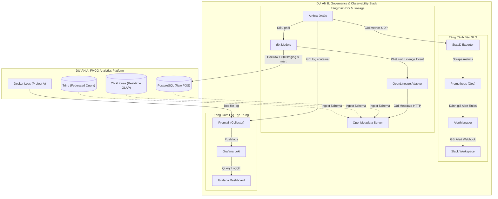

# Luồng Hoạt Động Hệ Thống (Data & Operational Flow)

Tài liệu này mô tả chi tiết luồng hoạt động của hệ thống **Data Platform Governance & Observability (Project B)**, bao gồm cách hệ thống tương tác với **Project A (FMCG Analytics)** và cách các cấu phần nội bộ phối hợp để quản trị, giám sát dữ liệu.

---

## 🗺️ Sơ Đồ Luồng Hoạt Động Tổng Thể

Dưới đây là sơ đồ Mermaid mô tả luồng đi của dữ liệu (Data Flow) và luồng giám sát (Observability Flow) giữa Project A và Project B:

---

## 1. Luồng 1: Metadata Cataloging (Tự động hóa Catalog dữ liệu)
Luồng này giúp doanh nghiệp có một kho lưu trữ thông tin (Data Catalog) tập trung, tự động cập nhật cấu trúc bảng biểu từ Project A.

* **Bước 1:** `OpenMetadata Server` và `OpenMetadata Ingestion` khởi chạy và kết nối trực tiếp vào Docker network chung `fmcg_fmcg-network`.
* **Bước 2 (Metadata Ingestion):** 
  * Bộ phận **Ingestion** (dựa trên các DAG Airflow nội bộ của OpenMetadata) kết nối tới các dịch vụ dữ liệu của Project A theo lịch định kỳ (Scheduled):
    * **PostgreSQL:** Quét database `fmcg`, lấy thông tin các bảng trong schema `public` và `analytics`.
    * **ClickHouse:** Lấy thông tin cấu trúc các bảng MergeTree và Materialized Views.
    * **Trino:** Quét các catalog kết nối để hiểu cách dữ liệu phân tán.
* **Bước 3:** Metadata thu thập được (tên bảng, kiểu dữ liệu cột, quan hệ khóa ngoại) được lưu vào MySQL của OpenMetadata và lập chỉ mục (index) lên Elasticsearch để người dùng có thể tìm kiếm nhanh trên UI (`http://localhost:8585`).

---

## 2. Luồng 2: Data Transformation & Lineage Tracking (Biến đổi & Vẽ đồ thị dữ liệu)
Luồng này thực hiện nhiệm vụ ETL/ELT từ dữ liệu thô sang dữ liệu tinh lọc, đồng thời tự động ghi nhận vòng đời dữ liệu (Lineage).

* **Bước 1:** Airflow Scheduler kích hoạt DAG `dbt_fmcg_transformation` theo lịch (hoặc trigger thủ công).
* **Bước 2 (Chạy dbt):** 
  * Airflow chạy lệnh `dbt run` bên trong container.
  * dbt sử dụng cấu hình trong `profiles.yml` truy cập vào **PostgreSQL (Project A)** để bắt đầu biến đổi:
    * Đọc dữ liệu từ bảng nguồn thô `pos_transactions`.
    * Tạo View staging `stg_pos_transactions` để chuẩn hóa dữ liệu.
    * Tạo các bảng Mart `mart_sales_by_region` và `mart_product_performance` lưu trữ kết quả phân tích cuối cùng.
* **Bước 3 (Thu thập Lineage):**
  * Trong quá trình dbt chạy, package `openlineage-airflow` và `dbt-openlineage` sẽ tự động bắt (hook) các truy vấn SQL đầu vào/đầu ra của dbt.
  * Các event này được chuyển thành các JSON payload chuẩn OpenLineage và gửi về API của `OpenMetadata Server`.
  * OpenMetadata phân tích payload và tự động vẽ lên đồ thị Lineage trực quan trên giao diện: **Bảng thô** ➔ **Staging View** ➔ **Mart Tables**.

---

## 3. Luồng 3: Observability & Alerting (Quan sát & Cảnh báo SLO)
Luồng này liên tục giám sát hiệu năng hoạt động của pipeline và gửi thông báo cảnh báo tức thời khi có lỗi xảy ra.

* **Bước 1:** Khi Airflow thực thi các task trong DAG, thư viện StatsD tích hợp sẵn trong Airflow liên tục gửi các metrics vận hành (như thời gian chạy, số lần thành công, số lần lỗi) dưới dạng gói tin UDP đến cổng `9125` của `StatsD Exporter`.
* **Bước 2:** `StatsD Exporter` dịch các chỉ số dạng text thô của StatsD thành định dạng metric có nhãn của Prometheus (ví dụ: chuyển từ `airflow.dagrun.duration.success.<dag_id>` sang metric `airflow_dagrun_duration_success_sum`).
* **Bước 3:** `Prometheus` quét (scrape) cổng `9102` của StatsD Exporter mỗi 10 giây để lưu trữ time-series.
* **Bước 4 (Đánh giá luật & Cảnh báo):**
  * Prometheus liên tục đối chiếu các metric thu thập được với các quy tắc trong `alert_rules.yml`.
  * Nếu phát hiện lỗi (ví dụ: DAG thất bại - `AirflowDagFailed`, hoặc thời gian thực thi trung bình của DAG vượt quá 5 phút - `PipelineSLOViolated`), Prometheus sẽ chuyển trạng thái rule sang `Firing` và gửi yêu cầu cảnh báo sang `AlertManager`.
* **Bước 5:** `AlertManager` nhận cảnh báo, áp dụng các luật lọc tin (routing), định dạng giao diện bằng template `slack.tmpl` và bắn webhook trực tiếp vào **Slack Channel** của đội ngũ Data Engineer.

---

## 4. Luồng 4: Centralized Logging (Gom log tập trung)
Luồng này giúp gom toàn bộ log hệ thống của cả Project A và Project B về một mối để tiện cho việc theo vết và xử lý sự cố.

* **Bước 1 (Docker SD):** Container `Promtail` được mount trực tiếp file socket của Docker engine (`/var/run/docker.sock`) và thư mục chứa logs của các container trên host máy tính.
* **Bước 2 (Lọc & Đẩy log):**
  * Promtail tự động quét và lọc ra các container có tên bắt đầu bằng `fmcg-` (Project A) và `gov-` (Project B).
  * Promtail đọc luồng logs thời gian thực, gắn nhãn (nhãn dự án, nhãn dịch vụ, cấp độ log như INFO/ERROR) thông qua quy tắc relabeling trong `promtail-config.yml`.
  * Các logs sau khi xử lý được Promtail đẩy (push) về `Loki` qua giao thức HTTP.
* **Bước 3 (Truy vấn & Trực quan hóa):**
  * Người dùng truy cập vào giao diện `Grafana (Project A)` trên cổng `3000`.
  * Grafana truy vấn dữ liệu log từ nguồn `Loki` bằng ngôn ngữ LogQL.
  * Các biểu đồ về tỷ lệ lỗi, tổng số dòng log và log stream trực tiếp của các dịch vụ quan trọng (như ClickHouse, Kafka, Airflow Scheduler) được hiển thị trực quan trên dashboard tập trung giúp rút ngắn thời gian điều tra lỗi.
